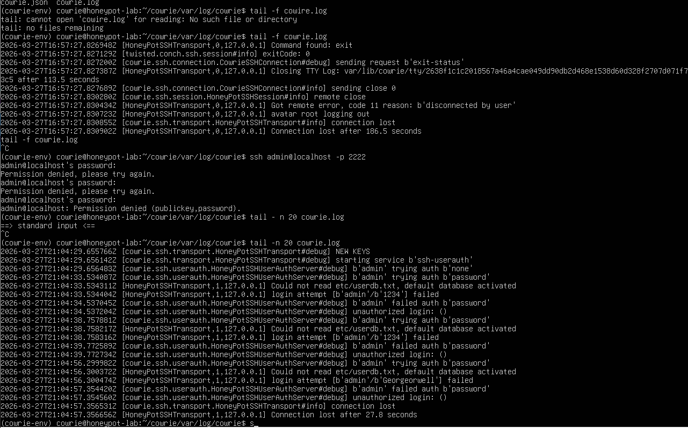

## Overview
This project demonstrates the deployment and validation of a Cowrie SSH honeypot in a controlled lab enviroment. The objective was to configure a functional honeypot capable of capturing and logging unauthorized access attempts, and to verify that logging mechanisms operate correctly.

---

## Environment
  - Ubuntu Server (VirtualBox VM)
  - Cowrie SSH Honeypot
  - Python Virtual Enviroment
  - Localhost (127.0.0.1) testing
  - SSH service configured on port 2222

## Installation & Setup
The following steps were performed to deploy the honeypot:
  - Installed system dependencies (Python, pip, git)
  - Cloned the Cowrie repository
  - Created and activated a python virtual environment
  - Installed required Python packages using pip
  - Copied and configured the default configuration file: 
```bash 
cp etc/cowrie.cfg.dist etc/cowrie.cfg
```
## Service Validtion
The Cowrie SSH honeypot was started successfully and configured to listen on TCP port 2222.
Verification command
```bash
ss -tulnp | grep 2222
```
## Testing & Interaction
A local SSH connection was attempted to simulate attacker behavior:
```bash
ssh admin@localhost -p 2222
```
## Log Analysis
Cowrie successfully captured and logged authentication attempts.



Example log observations:
  - Username: admin
  - Multiple failed login attempts
  - Authentication method: password
  - Source IP: 127.0.0.1 (local testing)
Logs were monitored in real time using:
```bash
tail -f cowrie.log
```
## Outcome
The honeypot was successfully deployed and validated.
  - Service was accessible via SSH
  - Login attempts were captured and logged
  - Logging functionally confirmed operational
This demonstrates the ability to deploy and verify a deception-based security control.

## Key Takeaways
  - Gained hands-on experience deploying a Cowrie SSH honeypot
  - Learned how to validate active network services 
  - Practiced monitoring analyzing authentication logs
  - Demonstrated understanding of attacker interaction simulation in a controlled environment
